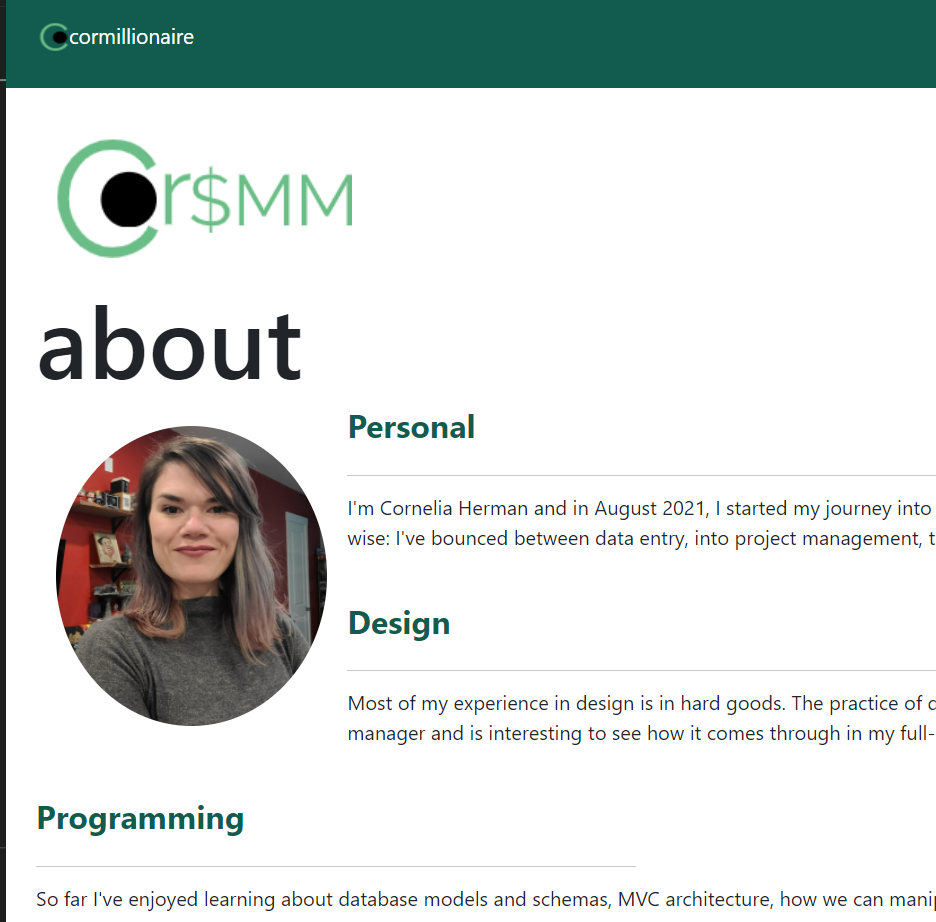

# cormillionaire portfolio
## Description
This project a single page application that hosts cormillionaire's portfolio and developer information

Live Link: [cormillionaire portfolio](https://cormillionaire.github.io/cormillionaire-portfolio/)

---
## Table of Contents
- [Installation](#installation)
- [Usage](#usage)
- [Credits](#credits)
- [License](#license)
- [Questions](#questions)
---
## Installation
- clone project
- npm i
- npm run build

## Usage
Home page is about us, About is about me, portfolio has links to other project, contact allows you to submit a message to cormillionaire, and resume is skills and a downloadable resume

## Tests
No npm tests but 

## Credits
### People
- Nando Davila - https://github.com/nandodavila

### Resources
- https://learnetto.com/blog/react-form-validation
- https://getbootstrap.com/docs/5.1/forms/validation/#custom-styles
- https://www.pluralsight.com/guides/how-to-implement-a-component-%22loop%22-with-react
- https://stackoverflow.com/questions/47616355/foreach-in-react-jsx-does-not-output-any-html
- https://stackoverflow.com/questions/32125708/how-can-i-access-a-hover-state-in-reactjs
- https://sirv.com/help/articles/hover-change-image/#:~:text=To%20swap%20an%20image%20when,%22rollover%22%20image%20becomes%20opaque
- https://reactjs.org/docs/components-and-props.html

## License

## Questions
Github UN: cormillionaire - [cormillionaire](https://github.com/cormillionaire)
You can contact me via email by emailing cormillionaire@gmail.com with your questions

